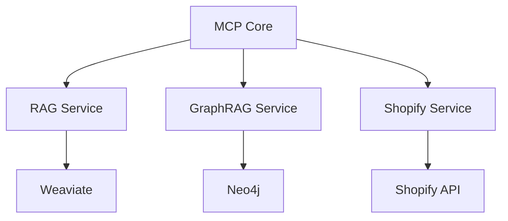

# MCP Service Platform

## 🎯 项目概述

这是一个基于Model Context Protocol (MCP)的综合服务平台，集成了以下功能：

- 🛍️ 电商服务 (Shopify集成)
- 📚 RAG (Retrieval Augmented Generation)
- 🕸️ GraphRAG (基于图数据库的RAG)
- 🧠 知识库管理
- 🔧 工具集成

## 🏗️ 系统架构



## 🚀 快速开始

### 环境要求

- Python 3.11+
- Docker & Docker Compose
- Neo4j 5.11+
- Weaviate 1.21+

### 安装步骤

1. 克隆仓库：
```bash
git clone <repository_url>
cd mcp-service
```

2. 安装依赖：
```bash
pip install -r requirements.txt
python -m spacy download en_core_web_sm
```

3. 配置环境变量：
```bash
cp .env.example .env
# 编辑 .env 文件，填入必要的配置
```

4. 启动服务：
```bash
# 启动数据库服务
docker-compose -f docker-compose.rag.yml up -d

# 启动MCP服务
python server.py
```

## 💡 功能特性

### RAG服务

- 文档嵌入和存储
- 语义相似度搜索
- 上下文增强生成
- 文档管理和删除

### GraphRAG服务

- 实体抽取和关系构建
- 图结构化存储
- 基于图的相似度搜索
- 上下文感知查询

### Shopify集成

- 商品搜索和浏览
- 购物车管理
- 结账流程
- 订单处理

## 📚 API文档

### RAG API

```python
# 添加文档
await client.add_documents(documents, ids=None, metadatas=None)

# 搜索相似内容
await client.search_similar(query, n_results=5)

# RAG查询
await client.rag_query(query, n_results=3)
```

### GraphRAG API

```python
# 添加文档和图结构
await client.add_document_graph(document, metadata=None)

# 图结构化搜索
await client.search_graph_similar(query, n_results=5)

# GraphRAG查询
await client.graphrag_query(query, use_graph_context=True)
```

### Shopify API

```python
# 搜索商品
await client.search_products(query)

# 添加到购物车
await client.add_to_cart(product_id, quantity)

# 完成结账
await client.checkout(cart_id)
```

## 🧪 测试

运行测试套件：

```bash
# 运行所有测试
pytest

# 运行特定测试
pytest tests/test_rag_operations.py
pytest tests/test_graphrag_operations.py
pytest tests/test_shopping_flow.py
```

## 📝 开发规范

- 遵循PEP 8编码规范
- 使用类型注解
- 编写单元测试
- 异步优先
- 文档完备

## 🔧 故障排除

### 常见问题

1. Weaviate连接失败
```
检查 WEAVIATE_URL 环境变量
确保Weaviate容器正在运行
```

2. Neo4j认证错误
```
验证 NEO4J_AUTH 环境变量
检查Neo4j容器状态
```

3. Shopify API限制
```
检查API速率限制
使用API令牌轮换
```

## 📦 部署

### Docker部署

```bash
# 构建镜像
docker build -t mcp-service .

# 运行容器
docker run -d -p 8000:8000 mcp-service
```

### Kubernetes部署

```bash
# 应用配置
kubectl apply -f k8s/

# 检查状态
kubectl get pods
```

## 🤝 贡献指南

1. Fork 仓库
2. 创建特性分支
3. 提交更改
4. 推送到分支
5. 创建Pull Request

## �� 许可证

MIT License
