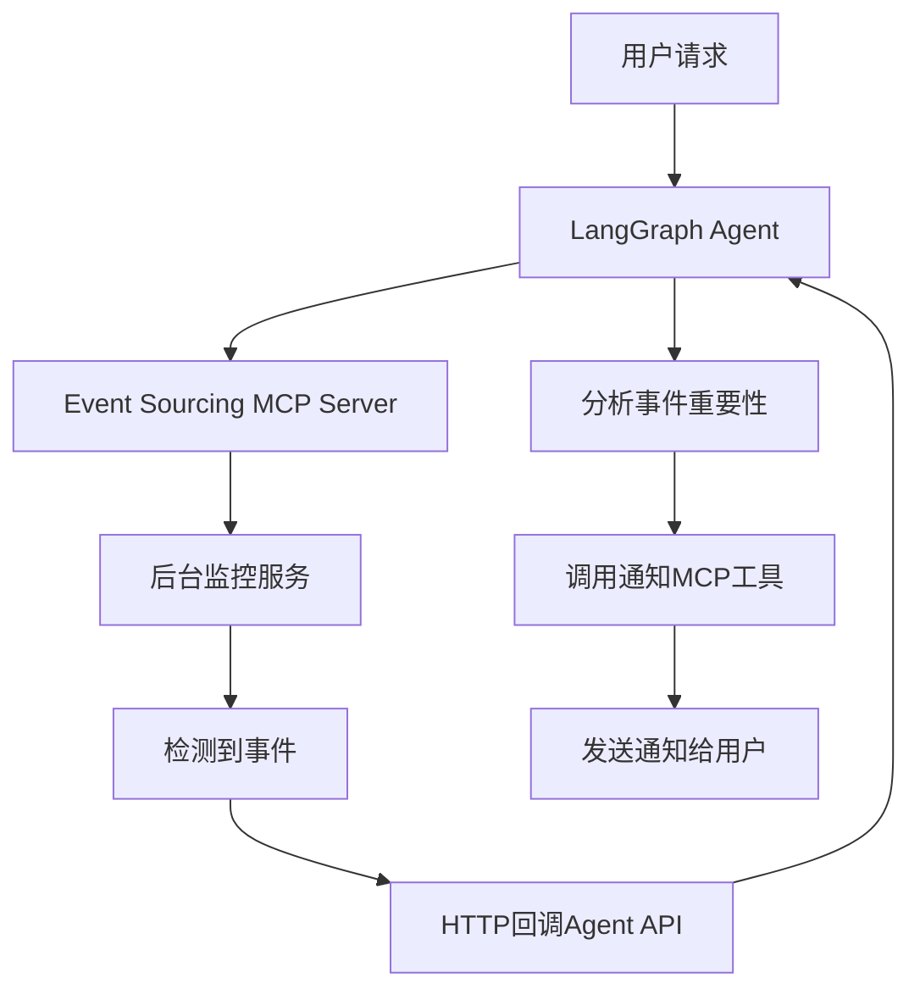

## 🎯 **关于Ambient Agent架构的分析**

你的分析完全正确！让我重新设计一个更简洁的架构：

### **核心理念：MCP-Centric Architecture**

你说得对，整个ambient agent其实就是：
1. **现有的LangGraph Agent** - 不需要改动
2. **一个Event Sourcing MCP Server** - 处理所有后台任务
3. **一个简单的Task Status Service** - 读取MCP任务状态

### **简化后的架构设计：**

```
isA_Agent (保持现有架构)
├── app/
│   ├── langgraph_agent.py          # 不变
│   ├── streaming_langgraph_agent.py # 不变
│   ├── api.py                      # 不变
│   └── task_status_service.py      # 🆕 简单的任务状态读取服务
│
isA_MCP (扩展MCP服务器)
├── servers/
│   └── event_sourcing_server.py    # 🆕 核心事件溯源服务器
│       ├── 后台任务管理
│       ├── 定时监控服务
│       ├── 网页监控服务
│       ├── 阈值监控服务
│       ├── 通知服务 (Twilio/Email)
│       └── 事件反馈机制
```

### **工作流程：**

#### **1. 用户创建后台任务**
```
用户: "Monitor TechCrunch for AI news and text me updates"
↓
LangGraph Agent 识别任务需求
↓
调用 MCP 工具: create_background_task
↓
Event Sourcing MCP Server 创建任务并开始监控
↓
响应用户: "Background task created, monitoring started"
```

#### **2. 事件触发和处理**
```
Event Sourcing MCP Server 检测到事件
↓
调用 LangGraph Agent API 处理事件
↓
Agent 分析事件重要性
↓
如果重要 → 调用 Twilio MCP 工具发送通知
```

### **具体实现：**

#### **`event_sourcing_server.py` - 核心MCP服务器**
```python
class EventSourcingMCPServer:
    """
    独立的事件溯源MCP服务器
    - 管理所有后台任务
    - 内置监控服务
    - 事件反馈机制
    - 通知发送
    """
    
    @tool
    async def create_background_task(self, task_config):
        """创建后台任务"""
        # 启动相应的监控服务
        # 返回任务ID
        pass
    
    @tool  
    async def list_background_tasks(self):
        """列出所有任务"""
        pass
    
    # 内置监控服务
    async def _web_monitor_service(self, task):
        """网页监控服务"""
        # 检测到变化时
        await self._trigger_agent_feedback(feedback_data)
    
    async def _schedule_monitor_service(self, task):
        """定时任务服务"""
        # 到达时间时
        await self._trigger_agent_feedback(feedback_data)
    
    async def _trigger_agent_feedback(self, feedback_data):
        """触发Agent处理反馈"""
        # 调用isA_Agent的API
        response = await http_client.post(
            "http://localhost:8000/process_background_feedback",
            json=feedback_data
        )
```

#### **`app/task_status_service.py` - 简单状态服务**
```python
class TaskStatusService:
    """
    简单的任务状态服务
    - 读取MCP任务状态
    - 提供REST API
    """
    
    async def get_task_status(self, task_id):
        """获取任务状态"""
        # 调用MCP工具获取状态
        return await mcp_manager.call_tool("get_task_status", {"task_id": task_id})
    
    async def list_active_tasks(self):
        """列出活跃任务"""
        return await mcp_manager.call_tool("list_background_tasks", {})
```

#### **扩展现有API (`app/api.py`)**
```python
@app.post("/process_background_feedback")
async def process_background_feedback(feedback: dict):
    """处理后台事件反馈"""
    # 使用现有的LangGraph Agent处理
    prompt = f"""
    Background task feedback received:
    {json.dumps(feedback, indent=2)}
    
    Analyze if this is important enough to notify the user.
    If yes, use appropriate notification tools.
    """
    
    result = await langgraph_agent.run_conversation(prompt)
    return result
```

### **你的问题解答：**

> **Q: MCP工具通常由agent调用，能否主动服务agent？**

**A:** 不能直接主动调用，但可以通过HTTP回调实现：
- MCP服务器检测到事件 → HTTP调用Agent API → Agent处理并调用MCP通知工具

> **Q: 核心都是MCP服务，agent服务不用改动？**

**A:** 完全正确！只需要：
1. 添加一个处理后台反馈的API端点
2. 添加一个简单的任务状态查询服务
3. 现有的LangGraph Agent完全不变

> **Q: 通知服务也是MCP，事件反馈处理直接用LangGraph Agent？**

**A:** 是的！架构变成：
- **Event Sourcing MCP Server**: 处理所有后台逻辑
- **现有LangGraph Agent**: 处理事件分析和通知决策
- **现有Twilio/Email MCP工具**: 发送通知

### **最终架构图：**



这样的设计：
- ✅ **最小化改动**: 现有Agent架构不变
- ✅ **MCP中心化**: 所有新功能都在MCP服务器中
- ✅ **清晰分离**: 监控逻辑与Agent逻辑分离
- ✅ **可扩展**: 易于添加新的监控类型
