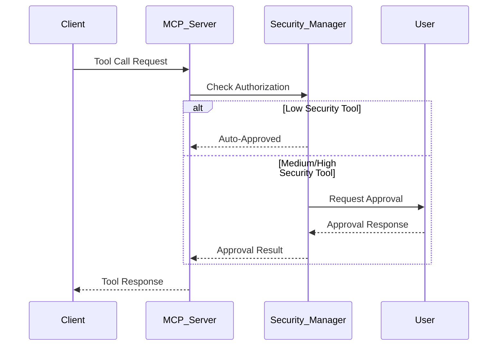

# API Reference

Welcome to the isA_MCP API documentation. This comprehensive reference covers all available tools, services, and endpoints in the Smart MCP Server.

## 🎯 API Overview

The isA_MCP API provides:

- **35+ Tools** across 8 major service categories
- **RESTful endpoints** for direct HTTP access
- **MCP Protocol** compliance for standardized tool calling
- **Authentication & Authorization** with JWT tokens
- **Comprehensive billing tracking** for AI operations
- **Standardized response formats** with metadata

## 🔗 Base URL & Endpoints

### Development
```
Base URL: http://localhost:4321
Health Check: http://localhost:4321/health
```

### Production (Load Balanced)
```
Base URL: http://localhost:8081
Health Check: http://localhost:8081/health
Load Balancer: Nginx with 3 server instances
```

### Cloud Deployment
```
Base URL: https://your-app.railway.app
Health Check: https://your-app.railway.app/health
```

## 🛠️ Tool Categories

### 📊 Data Analytics Tools
Transform natural language queries into SQL and analyze databases.

| Tool | Description | Security Level |
|------|-------------|----------------|
| `data_sourcing` | Extract metadata from databases and files | MEDIUM |
| `data_query` | Generate and execute SQL from natural language | MEDIUM |

### 🧩 Graph Analytics Tools  
Extract entities, relationships, and build knowledge graphs.

| Tool | Description | Security Level |
|------|-------------|----------------|
| `graph_build_knowledge` | Extract entities and relations, build graphs | MEDIUM |
| `graph_search_knowledge` | Search knowledge graphs with vector similarity | LOW |

### 🕸️ Web Services Tools
Intelligent web scraping and content extraction.

| Tool | Description | Security Level |
|------|-------------|----------------|
| `scrape_webpage` | Extract structured data from web pages | MEDIUM |
| `scrape_multiple_pages` | Batch scraping with pagination support | MEDIUM |
| `extract_page_links` | Extract and categorize links from pages | LOW |
| `search_page_content` | Search page content with AI filtering | LOW |

### 📚 RAG & Document Tools
Document processing and question-answering.

| Tool | Description | Security Level |
|------|-------------|----------------|
| `search_rag_documents` | Search document collections | LOW |
| `add_rag_documents` | Add documents to RAG collections | MEDIUM |
| `quick_rag_question` | Quick Q&A on single documents | LOW |

### 🛍️ E-commerce Tools
Shopify integration for product search and cart management.

| Tool | Description | Security Level |
|------|-------------|----------------|
| `search_products` | Search Shopify product catalog | LOW |
| `add_to_cart` | Add products to shopping cart | MEDIUM |
| `view_cart` | View current cart contents | LOW |
| `start_checkout` | Initiate checkout process | HIGH |
| `process_payment` | Process payment (test mode) | HIGH |

### 🧮 Memory Tools
Persistent information storage and retrieval.

| Tool | Description | Security Level |
|------|-------------|----------------|
| `remember` | Store information with categories | MEDIUM |
| `forget` | Delete stored memories | HIGH |
| `update_memory` | Update existing memories | MEDIUM |
| `search_memories` | Search stored memories | LOW |

### 🖼️ Image Generation Tools
AI-powered image creation and transformation.

| Tool | Description | Security Level |
|------|-------------|----------------|
| `generate_image` | Create images from text prompts | MEDIUM |
| `generate_image_to_file` | Generate and save images to files | MEDIUM |
| `image_to_image` | Transform existing images | MEDIUM |

### 🔧 Administrative Tools
System administration and monitoring.

| Tool | Description | Security Level |
|------|-------------|----------------|
| `request_authorization` | Request elevated permissions | LOW |
| `check_security_status` | Check current security level | LOW |
| `get_audit_log` | Retrieve audit logs | HIGH |

## 🔐 Authentication & Security

### JWT Token Authentication
```bash
# Get authentication token
curl -X POST http://localhost:4321/auth/login \
  -H "Content-Type: application/json" \
  -d '{"username": "user", "password": "password"}'

# Use token in requests
curl -H "Authorization: Bearer <jwt_token>" \
  http://localhost:4321/api/tools
```

### Security Levels
- **LOW**: Basic operations, read-only access
- **MEDIUM**: Data modification, API calls with costs
- **HIGH**: Administrative functions, data deletion

### Authorization Flow


## 📋 Request/Response Format

### Standard Tool Call Format
```json
{
  "tool": "tool_name",
  "parameters": {
    "param1": "value1",
    "param2": "value2"
  }
}
```

### Standard Response Format
```json
{
  "status": "success",
  "action": "tool_name", 
  "data": {
    "result": "Tool-specific response data"
  },
  "billing": {
    "total_cost_usd": 0.0123,
    "operations": [
      {
        "operation_name": "llm_call",
        "cost_usd": 0.0123,
        "timestamp": "2024-01-01T12:00:00Z"
      }
    ],
    "currency": "USD"
  },
  "timestamp": "2024-01-01T12:00:00Z"
}
```

### Error Response Format
```json
{
  "status": "error",
  "action": "tool_name",
  "error": "Detailed error message",
  "error_code": "VALIDATION_ERROR",
  "timestamp": "2024-01-01T12:00:00Z"
}
```

## 🔧 HTTP Endpoints

### Core Endpoints
```bash
GET  /health                    # Server health check
GET  /tools                     # List available tools  
POST /tools/{tool_name}         # Execute specific tool
GET  /auth/status               # Authentication status
POST /auth/login                # User authentication
POST /auth/logout               # User logout
GET  /metrics                   # Performance metrics
```

### Service-Specific Endpoints
```bash
# Data Analytics
POST /api/data/source           # Data sourcing
POST /api/data/query            # Data querying

# Graph Analytics  
POST /api/graph/build           # Build knowledge graph
POST /api/graph/search          # Search knowledge graph

# Web Services
POST /api/web/scrape            # Web scraping
POST /api/web/extract           # Content extraction

# Memory System
GET  /api/memory/search         # Search memories
POST /api/memory/store          # Store memory
PUT  /api/memory/update         # Update memory
DELETE /api/memory/{id}         # Delete memory
```

## 📊 Billing & Cost Tracking

### Cost Structure
```json
{
  "billing_summary": {
    "total_cost_usd": 1.2345,
    "operations": [
      {
        "service": "data_analytics",
        "operation": "llm_sql_generation", 
        "cost_usd": 0.0234,
        "tokens_used": 1500,
        "timestamp": "2024-01-01T12:00:00Z"
      },
      {
        "service": "web_services",
        "operation": "content_extraction",
        "cost_usd": 0.0156,
        "tokens_used": 1000,
        "timestamp": "2024-01-01T12:01:00Z"
      }
    ]
  }
}
```

### Cost Optimization
- **Caching**: Repeated queries use cached results
- **Batch Processing**: Multiple operations combined efficiently
- **Smart Chunking**: Optimal text processing for LLM calls
- **Fallback Strategies**: Cheaper alternatives when possible

## 🔍 Search & Filtering

### Vector Search Parameters
```json
{
  "query": "search query",
  "similarity_threshold": 0.7,
  "max_results": 10,
  "include_metadata": true,
  "filter": {
    "category": "research",
    "date_range": {
      "start": "2024-01-01",
      "end": "2024-12-31"
    }
  }
}
```

### Pagination
```json
{
  "page": 1,
  "page_size": 20,
  "sort_by": "relevance",
  "sort_order": "desc"
}
```

## 📈 Performance & Limits

### Rate Limits
```yaml
Default Limits:
  requests_per_minute: 60
  requests_per_hour: 1000
  concurrent_requests: 10

Premium Limits:  
  requests_per_minute: 300
  requests_per_hour: 10000
  concurrent_requests: 50
```

### Response Times (95th percentile)
```yaml
Tool Selection: <200ms
Data Query: <500ms  
Web Scraping: <3000ms
Graph Analytics: <1000ms
Memory Operations: <100ms
Image Generation: <5000ms
```

### Data Limits
```yaml
Text Input: 1MB per request
File Upload: 10MB per file
Batch Operations: 100 items per batch
Memory Storage: 1000 items per user
```

## 🧪 Testing & Development

### Test Endpoints
```bash
# Health check with detailed status
GET /health?detailed=true

# Tool validation
POST /tools/validate
{
  "tool": "data_query",
  "parameters": {"query": "test query"}
}

# Performance testing
GET /tools/benchmark/{tool_name}
```

### Development Tools
```bash
# API documentation
GET /docs                       # Interactive API docs
GET /openapi.json              # OpenAPI specification

# Debugging
GET /debug/tools               # Tool registration status  
GET /debug/embeddings          # Embedding status
GET /debug/cache               # Cache statistics
```

## 🔄 Webhooks & Events

### Event Types
```yaml
tool_execution_started:
  description: "Tool execution began"
  payload: {tool_name, parameters, timestamp}

tool_execution_completed:
  description: "Tool execution finished"  
  payload: {tool_name, result, duration, cost}

tool_execution_failed:
  description: "Tool execution failed"
  payload: {tool_name, error, timestamp}

security_authorization_requested:
  description: "High-security tool requires approval"
  payload: {tool_name, user_id, requested_permissions}
```

### Webhook Configuration
```json
{
  "webhook_url": "https://your-app.com/webhooks/isa-mcp",
  "events": ["tool_execution_completed", "security_authorization_requested"],
  "secret": "webhook_secret_key"
}
```

## 🌐 SDK & Client Libraries

### Python Client
```python
from isa_mcp_client import ISAMCPClient

client = ISAMCPClient(base_url="http://localhost:4321")
client.authenticate(username="user", password="password")

# Call tools
result = await client.call_tool("data_query", {
    "query": "Show top customers by revenue"
})
```

### JavaScript Client
```javascript
import { ISAMCPClient } from 'isa-mcp-client';

const client = new ISAMCPClient('http://localhost:4321');
await client.authenticate('user', 'password');

// Call tools
const result = await client.callTool('scrape_webpage', {
    url: 'https://example.com',
    extractionSchema: {products: ['name', 'price']}
});
```

---

**Next Sections:**
- [Authentication](authentication.md) - Detailed authentication guide
- [Tool Endpoints](tools.md) - Individual tool specifications  
- [Service APIs](services.md) - Service-specific API details
- [Error Handling](error-handling.md) - Error codes and troubleshooting