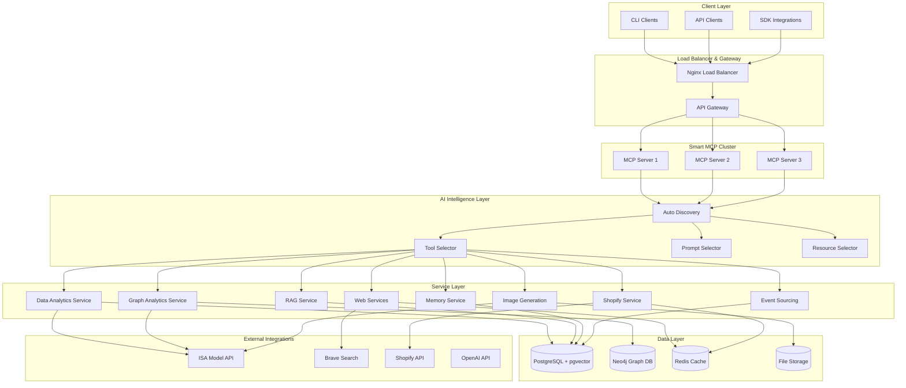
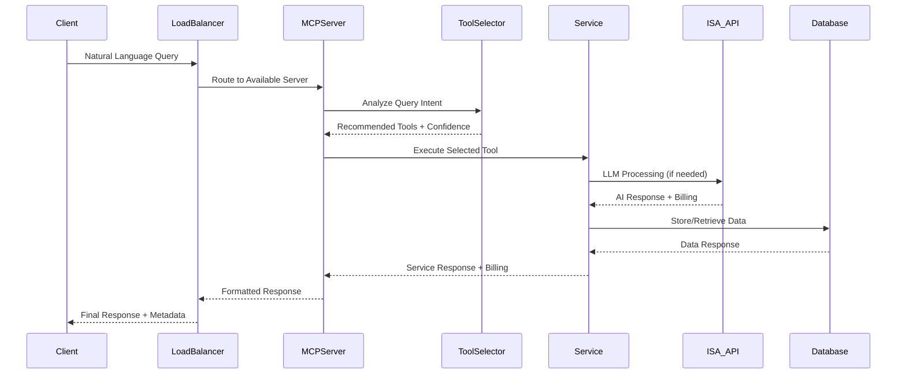
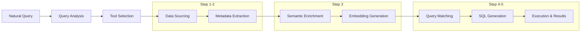
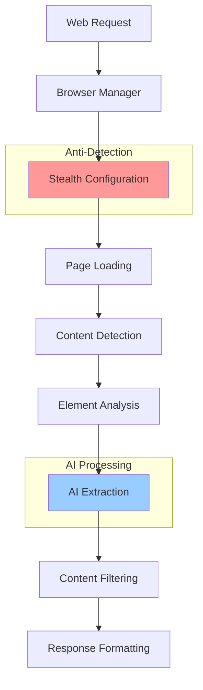

# System Architecture

isA_MCP is built with a modern, scalable architecture that combines AI intelligence with enterprise-grade reliability. This document provides a comprehensive overview of the system's design principles, components, and data flow.

## 🏗️ Architecture Overview

The system follows a layered architecture pattern with clear separation of concerns:



## 🎯 Design Principles

### 1. **AI-First Architecture**
- **Intelligent Tool Selection**: Natural language queries automatically map to appropriate tools
- **Context-Aware Processing**: Services understand and adapt to query context
- **Adaptive Workflows**: System learns from usage patterns to optimize performance

### 2. **Microservices Design**
- **Service Isolation**: Each service is independently deployable and scalable
- **Clear Boundaries**: Well-defined interfaces between components
- **Fault Tolerance**: Failure in one service doesn't affect others

### 3. **Scalability & Performance**
- **Horizontal Scaling**: Add more server instances as needed
- **Load Balancing**: Distribute requests across multiple servers
- **Caching Strategy**: Multi-layer caching for optimal performance

### 4. **Enterprise Security**
- **Multi-Level Authorization**: LOW, MEDIUM, HIGH security levels
- **Audit Logging**: Comprehensive tracking of all operations
- **JWT Authentication**: Secure token-based authentication

## 🧩 Core Components

### Smart MCP Server Core
```python
class SmartMCPServer:
    """
    Main server orchestrating all services and AI components
    """
    def __init__(self):
        self.auto_discovery = AutoDiscovery()
        self.tool_selector = ToolSelector()
        self.security_manager = SecurityManager()
        self.service_registry = ServiceRegistry()
```

**Responsibilities:**
- Tool registration and discovery
- Request routing and load balancing
- Security enforcement and audit logging
- Service lifecycle management

### AI Intelligence Layer

#### Auto Discovery System
```python
class AutoDiscovery:
    """
    Automatically discovers and registers tools, prompts, and resources
    """
    async def discover_tools(self) -> Dict[str, ToolMetadata]:
        # Scans codebase for MCP tools
        # Extracts metadata from docstrings
        # Generates embeddings for semantic search
```

#### Tool Selector
```python
class ToolSelector:
    """
    AI-powered tool selection based on natural language queries
    """
    async def select_tools(self, query: str) -> List[ToolRecommendation]:
        # Analyzes query semantics
        # Matches against tool embeddings
        # Returns ranked tool recommendations
```

### Service Layer Architecture

Each service follows the same architectural pattern:

```python
class BaseService:
    """Base class for all services"""
    def __init__(self, service_name: str):
        self.isa_client = get_isa_client()
        self.security_manager = get_security_manager()
        self.billing_tracker = BillingTracker()
    
    async def call_isa_with_billing(self, ...):
        # Unified ISA API calling with cost tracking
        
    def create_service_response(self, ...):
        # Standardized response format with billing info
```

## 📊 Data Flow Architecture

### 1. Request Processing Flow



### 2. Data Analytics Workflow



### 3. Web Services Pipeline



## 🔧 Service Architecture Details

### Data Analytics Service
```python
class DataAnalyticsService(BaseService):
    """
    5-step data processing workflow
    """
    components:
        - MetadataExtractor: Database schema analysis
        - SemanticEnricher: Business entity identification  
        - EmbeddingStorage: Vector storage with pgvector
        - QueryMatcher: Natural language to SQL intent
        - SQLExecutor: Query generation and execution
```

### Graph Analytics Service
```python
class GraphAnalyticsService(BaseService):
    """
    Entity extraction and relationship mapping
    """
    components:
        - EntityExtractor: Named entity recognition
        - RelationExtractor: Relationship identification
        - Neo4jClient: Graph database operations
        - KnowledgeGraph: Graph construction and querying
```

### Web Services Platform
```python
class WebServicesManager:
    """
    Intelligent web scraping and automation
    """
    components:
        - BrowserManager: Playwright automation with stealth
        - DetectionEngine: Element identification strategies
        - ExtractionEngine: Content extraction with AI
        - FilteringEngine: Relevance scoring and filtering
```

## 🗄️ Data Layer Design

### PostgreSQL + pgvector
```sql
-- Core tables for data analytics
CREATE TABLE metadata_cache (
    id SERIAL PRIMARY KEY,
    table_name TEXT,
    columns JSONB,
    embeddings vector(1536)
);

-- Memory system tables
CREATE TABLE memories (
    id UUID PRIMARY KEY,
    key TEXT,
    value TEXT,
    category TEXT,
    keywords TEXT[],
    embeddings vector(1536)
);
```

### Neo4j Graph Database
```cypher
// Entity and relationship storage
CREATE (e:Entity {
    id: $entity_id,
    type: $entity_type,
    canonical_form: $name,
    confidence: $confidence
})

CREATE (r:Relation {
    type: $relation_type,
    confidence: $confidence
})-[:CONNECTS]->(source:Entity)-[:TO]->(target:Entity)
```

### Redis Caching Strategy
```python
# Multi-layer caching
cache_layers = {
    'tool_embeddings': 3600,      # 1 hour
    'web_sessions': 1800,         # 30 minutes  
    'query_results': 600,         # 10 minutes
    'metadata_cache': 7200,       # 2 hours
}
```

## 🔐 Security Architecture

### Authentication & Authorization
```python
class SecurityManager:
    """
    Multi-level security enforcement
    """
    security_levels = {
        'LOW': ['get_weather', 'search_memories'],
        'MEDIUM': ['remember', 'data_query'], 
        'HIGH': ['forget', 'admin_functions']
    }
    
    async def authorize_tool(self, tool_name: str, user_context: dict):
        # Check security level requirements
        # Validate JWT tokens
        # Log audit events
```

### Audit Logging
```python
class AuditLogger:
    """
    Comprehensive operation tracking
    """
    async def log_operation(self, 
                           user_id: str,
                           tool_name: str, 
                           parameters: dict,
                           result: dict,
                           billing_info: dict):
        # Store in audit_logs table
        # Include security context
        # Track billing information
```

## 📈 Performance Characteristics

### Benchmarks
- **Tool Selection Response**: < 200ms
- **Web Scraping Success Rate**: 95%+
- **Database Query Average**: < 500ms  
- **Memory Usage per Container**: ~500MB
- **Startup Time**: < 30 seconds

### Scalability Metrics
- **Concurrent Users per Server**: 100+
- **Requests per Second**: 1,000+
- **Horizontal Scaling**: Linear scaling up to 10+ instances
- **Database Connections**: Pool size 10-50 per service

### Monitoring & Observability
- **Health Checks**: `/health` endpoint on all services
- **Metrics Collection**: Prometheus integration
- **Distributed Tracing**: Request correlation across services
- **Performance Profiling**: Built-in performance monitoring

## 🔄 Deployment Architecture

### Development Environment
```yaml
# Single server instance
smart_mcp_server.py
├── Auto Discovery
├── All Services  
├── SQLite/PostgreSQL
└── File-based storage
```

### Production Cluster
```yaml
# Load-balanced cluster
nginx_load_balancer:8081
├── smart_mcp_server_1:4321
├── smart_mcp_server_2:4322  
├── smart_mcp_server_3:4323
├── postgresql_cluster
├── neo4j_cluster
└── redis_cluster
```

### Cloud Deployment
```yaml
# Railway/Docker deployment
services:
  - smart_mcp_server (auto-scaling)
  - postgresql (managed)
  - redis (managed)
  - neo4j (managed)
```

---

**Next Steps:**
- [Core Components](core-components.md) - Detailed component specifications
- [Service Layer](service-layer.md) - Individual service architectures  
- [Data Layer](data-layer.md) - Database design and data flow
- [Security Model](security-model.md) - Security implementation details