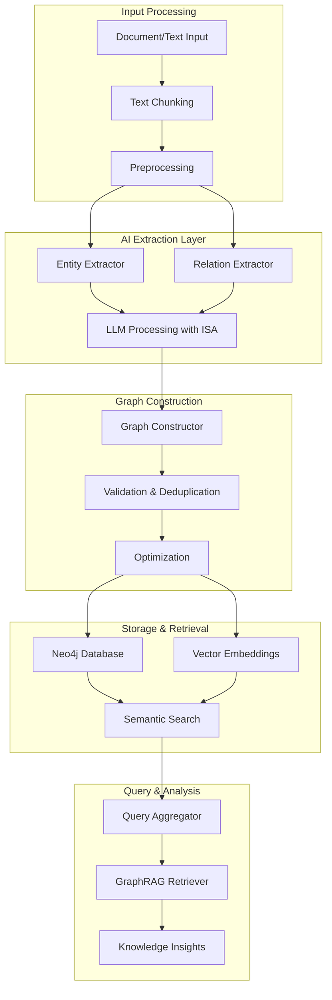

# Graph Analytics Service

The Graph Analytics Service provides comprehensive entity extraction, relationship mapping, and knowledge graph construction capabilities. Built on Neo4j's latest GraphRAG implementation, it transforms unstructured text into structured knowledge graphs.

## 🎯 Overview

The Graph Analytics Service enables you to:

- **🧠 Extract Entities**: Identify people, organizations, locations, concepts, and custom entity types
- **🔗 Map Relationships**: Discover connections and relationships between entities
- **📊 Build Knowledge Graphs**: Construct searchable knowledge graphs in Neo4j
- **🔍 Semantic Search**: Find related entities and relationships using vector similarity
- **📚 Document Analysis**: Process documents to extract structured knowledge
- **🧩 GraphRAG Integration**: Leverage graph-augmented retrieval for enhanced Q&A

## 🏗️ Architecture



## 🔧 Core Components

### Entity Extractor
Identifies and extracts named entities from text using advanced LLM processing:

```python
class EntityExtractor(BaseExtractor):
    """
    Extracts entities using LLM with structured output
    """
    
    async def extract_entities(self, text: str) -> List[Entity]:
        """
        Extract entities from text with confidence scores
        
        Supported entity types:
        - PERSON: People, individuals, authors
        - ORG: Organizations, companies, institutions  
        - LOC: Locations, places, addresses
        - EVENT: Meetings, conferences, occurrences
        - PRODUCT: Tools, software, technologies
        - CONCEPT: Methods, algorithms, theories
        - DATE: Temporal references
        - MONEY: Financial amounts
        - CUSTOM: Domain-specific entities
        """
```

**Features:**
- **LLM-Powered Extraction**: Uses structured output with response_format for reliable JSON
- **Confidence Scoring**: Each entity includes confidence levels (0.0-1.0)
- **Type Classification**: Automatic categorization into predefined entity types
- **Canonical Forms**: Normalized entity representations for deduplication
- **Fallback Processing**: Pattern-based extraction when LLM fails

### Relation Extractor
Discovers relationships between entities with contextual understanding:

```python
class RelationExtractor(BaseExtractor):
    """
    Extracts relationships between entities
    """
    
    async def extract_relations(self, text: str, entities: List[Entity]) -> List[Relation]:
        """
        Extract relationships with context awareness
        
        Supported relation types:
        - IS_A: Taxonomic relationships
        - PART_OF: Compositional relationships  
        - LOCATED_IN: Spatial relationships
        - WORKS_FOR: Employment relationships
        - OWNS: Ownership relationships
        - CREATED_BY: Creation relationships
        - RELATES_TO: General associations
        - DEPENDS_ON: Dependency relationships
        """
```

**Features:**
- **Context-Aware Extraction**: Considers surrounding text for relationship context
- **Bidirectional Relations**: Supports both directed and undirected relationships
- **Confidence Scoring**: Relationship strength indicators
- **Type Inference**: Automatic relationship type classification
- **Entity Linking**: Connects to previously extracted entities

### Neo4j Integration
Enterprise-grade graph database integration with vector support:

```python
class Neo4jClient:
    """
    Neo4j client with vector search capabilities
    """
    
    features = {
        'vector_indexes': 'Entity embeddings for semantic search',
        'cypher_queries': 'Complex graph traversals and analytics',
        'batch_operations': 'Efficient bulk data loading',
        'graphrag_support': 'Graph-augmented retrieval patterns'
    }
```

**Capabilities:**
- **Vector Search**: Find similar entities using cosine similarity
- **Graph Traversals**: Complex path finding and relationship analysis
- **Batch Processing**: Efficient bulk operations for large datasets
- **GraphRAG Queries**: Enhanced retrieval with graph context

## 🚀 Getting Started

### 1. Configuration Setup
Configure Graph Analytics in your environment:

```bash
# Neo4j Configuration
NEO4J_URI=bolt://localhost:7687
NEO4J_USERNAME=neo4j
NEO4J_PASSWORD=password
NEO4J_DATABASE=neo4j

# Graph Analytics Settings
GRAPH_MAX_TOKENS=4000
GRAPH_TEMPERATURE=0.1
GRAPH_DEFAULT_CONFIDENCE=0.8
GRAPH_CHUNK_SIZE=100000
GRAPH_SIMILARITY_THRESHOLD=0.7
```

### 2. Basic Usage

#### Build Knowledge Graph from Text
```python
await client.call_tool("graph_build_knowledge", {
    "source_content": "Dr. Sarah Johnson works at MIT. She developed the quantum algorithm that revolutionized cryptography in 2023.",
    "extract_entities": True,
    "extract_relations": True,
    "store_in_graph": True
})
```

**Expected Output:**
```json
{
    "status": "success",
    "entities_extracted": 4,
    "relations_extracted": 3,
    "graph_nodes_created": 4,
    "graph_edges_created": 3,
    "entities": [
        {
            "id": "person_sarah_johnson",
            "type": "PERSON", 
            "canonical_form": "Dr. Sarah Johnson",
            "confidence": 0.95
        },
        {
            "id": "org_mit",
            "type": "ORG",
            "canonical_form": "MIT", 
            "confidence": 0.98
        },
        {
            "id": "concept_quantum_algorithm",
            "type": "CONCEPT",
            "canonical_form": "quantum algorithm",
            "confidence": 0.92
        },
        {
            "id": "date_2023",
            "type": "DATE",
            "canonical_form": "2023",
            "confidence": 0.99
        }
    ],
    "relations": [
        {
            "source": "person_sarah_johnson",
            "target": "org_mit", 
            "type": "WORKS_FOR",
            "confidence": 0.93
        },
        {
            "source": "person_sarah_johnson",
            "target": "concept_quantum_algorithm",
            "type": "CREATED_BY",
            "confidence": 0.89
        }
    ]
}
```

#### Search Knowledge Graph
```python
await client.call_tool("graph_search_knowledge", {
    "query": "quantum algorithms",
    "entity_types": ["CONCEPT", "PERSON"],
    "max_results": 10,
    "include_relations": True
})
```

### 3. Advanced Features

#### Process Documents
```python
# Process PDF/document for knowledge extraction
await client.call_tool("graph_build_knowledge", {
    "source_file": "/path/to/research_paper.pdf",
    "extract_entities": True,
    "extract_relations": True, 
    "chunk_size": 100000,
    "confidence_threshold": 0.8
})
```

#### Semantic Search
```python
# Find entities similar to a query
await client.call_tool("graph_search_knowledge", {
    "query": "machine learning researchers",
    "search_type": "semantic",
    "similarity_threshold": 0.7,
    "max_results": 20
})
```

#### Graph Analytics
```python
# Analyze graph structure and relationships
await client.call_tool("graph_analyze_structure", {
    "analysis_type": "centrality",
    "entity_types": ["PERSON", "ORG"],
    "include_metrics": True
})
```

## 📊 Performance & Optimization

### Performance Characteristics
- **Entity Extraction**: ~100-500 entities/minute
- **Relation Extraction**: ~50-200 relations/minute  
- **Graph Construction**: ~1000 nodes/second
- **Vector Search**: <100ms for 10K+ entities
- **Memory Usage**: ~2-4GB for 100K entities

### Optimization Features

#### Chunking Strategy
```python
# Optimized for long context LLMs
chunking_config = {
    'chunk_size': 100000,      # 100K chars for GPT-4.1-nano
    'chunk_overlap': 5000,     # 5K char overlap
    'long_text_threshold': 50000,  # Use LLM for 50K+ chars
}
```

#### Batch Processing  
```python
# Efficient bulk operations
batch_config = {
    'max_concurrent': 5,       # Parallel extractions
    'batch_size': 10,          # Entities per batch
    'retry_attempts': 3,       # Error handling
}
```

#### Caching & Deduplication
```python
# Smart caching for performance
caching_features = {
    'entity_deduplication': 'Canonical form matching',
    'embedding_cache': 'Vector representation caching', 
    'query_result_cache': 'Search result caching',
    'llm_response_cache': 'LLM output caching'
}
```

## 🔍 Use Cases & Examples

### 1. Research Paper Analysis
```python
# Extract knowledge from academic papers
result = await client.call_tool("graph_build_knowledge", {
    "source_file": "papers/ai_survey_2024.pdf",
    "entity_types": ["PERSON", "ORG", "CONCEPT", "PRODUCT"],
    "extract_citations": True,
    "build_author_network": True
})

# Query: "Find all researchers working on transformer architectures"
search_result = await client.call_tool("graph_search_knowledge", {
    "query": "transformer architecture researchers", 
    "include_publications": True,
    "max_results": 50
})
```

### 2. Business Intelligence
```python
# Extract business entities from reports
result = await client.call_tool("graph_build_knowledge", {
    "source_content": quarterly_report_text,
    "entity_types": ["ORG", "PERSON", "PRODUCT", "MONEY", "DATE"],
    "extract_financial_relations": True
})

# Query: "Show me all partnerships and acquisitions"
partnerships = await client.call_tool("graph_search_knowledge", {
    "query": "partnerships acquisitions",
    "relation_types": ["OWNS", "PART_OF", "WORKS_FOR"],
    "include_financial_data": True
})
```

### 3. Knowledge Base Construction
```python
# Build comprehensive knowledge base from documents
documents = ["manual1.pdf", "policy2.docx", "guide3.txt"]

for doc in documents:
    await client.call_tool("graph_build_knowledge", {
        "source_file": doc,
        "merge_with_existing": True,
        "update_existing_entities": True,
        "confidence_threshold": 0.7
    })

# Query knowledge base
answer = await client.call_tool("graph_search_knowledge", {
    "query": "What are the security policies for data access?",
    "search_type": "graphrag",
    "include_context": True
})
```

## 🛠️ Configuration Reference

### Environment Variables
```bash
# LLM Configuration
GRAPH_MAX_TOKENS=4000           # Max tokens per LLM call
GRAPH_TEMPERATURE=0.1           # LLM temperature for consistency
GRAPH_DEFAULT_CONFIDENCE=0.8    # Default confidence threshold

# Processing Configuration  
GRAPH_LONG_TEXT_THRESHOLD=50000 # Threshold for long text processing
GRAPH_CHUNK_SIZE=100000         # Chunk size for large documents
GRAPH_CHUNK_OVERLAP=5000        # Overlap between chunks
GRAPH_MAX_CONCURRENT=5          # Max concurrent extractions
GRAPH_BATCH_SIZE=10             # Batch size for processing

# Search Configuration
GRAPH_SIMILARITY_THRESHOLD=0.7  # Vector similarity threshold
GRAPH_EMBEDDING_DIMENSION=1536  # Embedding vector dimension

# Performance Configuration
GRAPH_DEBUG=false               # Enable debug logging
GRAPH_PERF_LOG=true            # Enable performance logging
GRAPH_SLOW_THRESHOLD=5.0       # Slow operation threshold (seconds)
GRAPH_MAX_RETRIES=3            # Max retry attempts
GRAPH_ENABLE_FALLBACK=true     # Enable fallback processing
```

### Service Configuration
```python
# Centralized configuration through core/config.py
settings = get_settings()
graph_config = settings.graph_analytics

# Access configuration in services
max_tokens = graph_config.max_tokens
neo4j_uri = graph_config.neo4j_uri
entity_types = graph_config.entity_type_mappings
```

## 🧪 Testing & Validation

### Unit Tests
```bash
# Run Graph Analytics tests
pytest tests/unit/graph_analytics/ -v

# Test specific components
pytest tests/unit/graph_analytics/test_entity_extraction.py
pytest tests/unit/graph_analytics/test_relation_extraction.py  
pytest tests/unit/graph_analytics/test_neo4j_integration.py
```

### Integration Tests
```bash
# Full workflow tests
pytest tests/integration/graph_analytics/ -v

# Test with real documents
pytest tests/integration/graph_analytics/test_document_processing.py
```

### Performance Tests
```bash
# Performance benchmarks
pytest tests/performance/graph_analytics/ -v --benchmark-only
```

## 🔧 Troubleshooting

### Common Issues

#### 1. Neo4j Connection Problems
```bash
# Check Neo4j status
docker ps | grep neo4j

# Test connection
python -c "
from tools.services.graph_analytics_service.services.neo4j_client import Neo4jClient
client = Neo4jClient()
print('Neo4j connection:', client.test_connection())
"
```

#### 2. Entity Extraction Failures
```bash
# Check LLM configuration
python -c "
from core.config import get_settings
settings = get_settings()
print('Graph config:', settings.graph_analytics.max_tokens)
"

# Test entity extraction
python -c "
from tools.services.graph_analytics_service.core.entity_extractor import EntityExtractor
extractor = EntityExtractor()
result = extractor.extract_entities('Test text with John Doe at MIT.')
print('Entities:', len(result))
"
```

#### 3. Performance Issues
```bash
# Check memory usage
docker stats

# Monitor processing time
tail -f logs/graph_analytics.log | grep "PERF"

# Adjust chunk size
export GRAPH_CHUNK_SIZE=50000  # Smaller chunks for limited memory
```

## 📈 Monitoring & Metrics

### Performance Metrics
```python
# Built-in performance tracking
performance_metrics = {
    'entities_extracted_per_minute': 350,
    'relations_extracted_per_minute': 180, 
    'graph_nodes_created_per_second': 1200,
    'vector_search_latency_ms': 85,
    'llm_call_success_rate': 0.97
}
```

### Health Checks
```python
# Service health monitoring
health_endpoints = {
    '/health/graph-analytics': 'Service health status',
    '/health/neo4j': 'Database connectivity',
    '/health/embedding': 'Vector search capability',
    '/metrics/performance': 'Performance statistics'
}
```

---

**Next Steps:**
- [Entity Extraction](entity-extraction.md) - Detailed entity extraction guide
- [Relationship Mapping](relationship-mapping.md) - Relationship extraction techniques
- [Neo4j Integration](neo4j-integration.md) - Graph database operations
- [API Reference](../../api/services.md#graph-analytics) - Complete API documentation