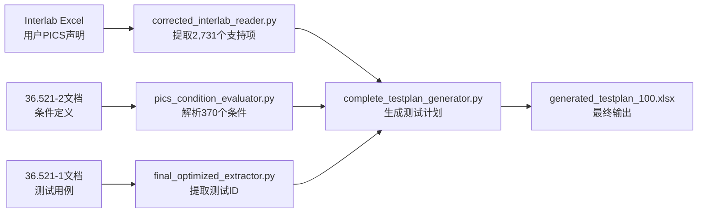

# 测试计划生成系统 - 当前数据流和文件使用情况

## 🎯 核心使用文件

### 1. **核心Python脚本（正在使用的）**

```
services/
├── extractor/
│   └── final_optimized_extractor.py       # ⭐ 主要测试ID提取器（67.2%召回率）
├── engine/
│   ├── pics_condition_evaluator.py        # 条件评估引擎
│   └── complete_testplan_generator.py     # 测试计划生成器
└── processor/
    └── corrected_interlab_reader.py       # Interlab Excel读取器
```

### 2. **输入数据文件**

#### 用户PICS声明（必需）
```
data_source/test_cases/
├── Interlab_EVO_Feature_Spreadsheet_PDX-256_*.xlsx  # ⭐ 主要输入
├── PDX-256_All_2025-09-20_19_32_17_0.00%.xlsx      # 真实测试计划（对比用）
└── Interlab_EVO_Feature_Spreadsheet_Template_*.xlsx # 模板文件
```

#### 3GPP文档（测试ID来源）
```
data_source/3GPP/
├── TS 36.521-1/36521-1-i80/   # 测试定义文档（11个分片）
├── TS 36.521-2/36521-2-i80/   # PICS条件定义
└── TS 36.521-3/36521-3-i80/   # 补充测试定义
```

## 📤 输出文件位置

### 中间结果（outputs/目录）

#### JSON格式提取结果
- `interlab_supported_pics.json` - 用户支持的PICS（2,731项）
- `complete_conditions.json` - 条件定义（370个）
- `test_applicability_results.json` - 测试适用性结果
- `generated_test_plan.json` - 生成的测试计划JSON

#### Excel格式最终输出
- `generated_testplan_100.xlsx` - ⭐ **最终生成的测试计划**
- `corrected_test_plan_*.xlsx` - 修正版测试计划
- `test_plan_comparison.xlsx` - 对比分析结果

#### 分析报告
- `FINAL_ACCURACY_REPORT.md` - 准确率报告
- `QUALITY_ANALYSIS_REPORT.md` - 质量分析
- `AI_EXTRACTION_OPTIMIZATION_REPORT.md` - AI优化报告

## 🔄 数据处理流程



## 📊 数据规模

| 数据类型 | 文件位置 | 数量 |
|---------|---------|------|
| **输入PICS** | Interlab Excel | 12,651项 |
| **用户支持** | interlab_supported_pics.json | 2,731项 |
| **条件定义** | complete_conditions.json | 370个 |
| **提取测试ID** | 内存中处理 | 1,028个 |
| **选中测试** | generated_test_plan.json | 259个 |
| **最终行数** | generated_testplan_100.xlsx | 5,695行 |

## ⚠️ 关键路径依赖

1. **必须先运行**：`corrected_interlab_reader.py` 提取用户PICS
2. **然后运行**：`final_optimized_extractor.py` 提取测试ID
3. **最后运行**：`complete_testplan_generator.py` 生成最终计划

## 🚨 当前问题

- 测试ID提取召回率仅67.2%（缺失85个测试）
- 只处理了36.521系列，未处理其他27个规范
- AI提取存在超时问题

## 💡 文件使用建议

- **查看用户PICS**：打开 `outputs/interlab_supported_pics.json`
- **查看生成结果**：打开 `outputs/generated_testplan_100.xlsx`
- **对比真实数据**：使用 `PDX-256_All_2025-09-20_19_32_17_0.00%.xlsx`
- **分析准确率**：查看 `outputs/FINAL_ACCURACY_REPORT.md`

---
*生成时间：2025-09-22*