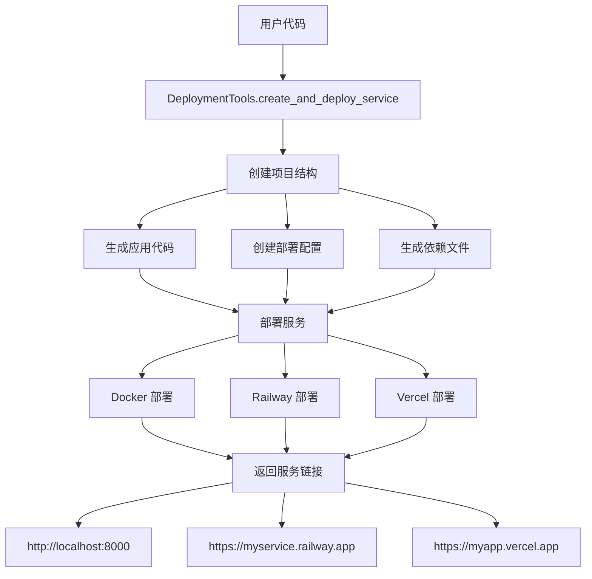

# 代码自动部署工作流

## 概述

基于 Terminal Service 扩展的自动化部署工具，支持从代码编写到服务部署再到链接返回的完整工作流。

## 🎯 功能特性

### 完整工作流支持
- **📝 代码生成**: 自动创建完整的项目结构
- **🚀 自动部署**: 支持多种部署平台（Railway、Docker、Vercel）
- **🔗 链接返回**: 自动生成可访问的服务URL
- **🔒 安全验证**: 继承Terminal Service的安全机制

### 支持的服务类型
- **FastAPI**: 现代异步Web API框架
- **Flask**: 轻量级Web应用框架  
- **Simple HTTP**: 基础HTTP服务器

### 支持的部署平台
- **Railway**: 云端部署平台
- **Docker**: 本地容器化部署
- **Vercel**: 前端应用部署平台

## 🏗️ 架构设计



## 🛠️ 使用方法

### 基本用法

```python
# 调用部署工具
result = await deployment_tools.create_and_deploy_service(
    project_name="my-api-service",
    code_content="""
@app.get("/api/users")
async def get_users():
    return {"users": ["Alice", "Bob", "Charlie"]}

@app.post("/api/users")
async def create_user(name: str):
    return {"message": f"User {name} created", "id": 123}
    """,
    service_type="fastapi",
    deployment_platform="railway",
    port=8000,
    requirements=["requests", "pandas"]
)
```

### 响应格式

```json
{
  "status": "success",
  "action": "create_and_deploy_service",
  "data": {
    "project_name": "my-api-service",
    "service_url": "https://my-api-service.railway.app",
    "deployment_platform": "railway",
    "port": 8000,
    "project_path": "/tmp/deployments/my-api-service",
    "deployment_logs": ["Successfully deployed to Railway"],
    "service_type": "fastapi",
    "created_at": "2025-01-21T10:30:45.123456"
  },
  "billing_info": {
    "total_cost": 0.0,
    "operations": []
  }
}
```

## 📋 详细示例

### 示例1: FastAPI 数据服务

```python
code_content = """
from pydantic import BaseModel
from typing import List

class Item(BaseModel):
    id: int
    name: str
    price: float

# 模拟数据库
items_db = [
    {"id": 1, "name": "Laptop", "price": 999.99},
    {"id": 2, "name": "Phone", "price": 599.99}
]

@app.get("/api/items", response_model=List[Item])
async def get_items():
    return items_db

@app.get("/api/items/{item_id}")
async def get_item(item_id: int):
    for item in items_db:
        if item["id"] == item_id:
            return item
    raise HTTPException(status_code=404, detail="Item not found")

@app.post("/api/items")
async def create_item(item: Item):
    items_db.append(item.dict())
    return {"message": "Item created", "item": item}
"""

result = await deployment_tools.create_and_deploy_service(
    project_name="items-api",
    code_content=code_content,
    service_type="fastapi",
    deployment_platform="railway",
    requirements=["pydantic>=2.0.0"]
)
```

**生成的服务URL**: `https://items-api.railway.app`

**可用端点**:
- `GET /` - 服务状态
- `GET /health` - 健康检查
- `GET /api/items` - 获取所有商品
- `GET /api/items/{id}` - 获取单个商品
- `POST /api/items` - 创建新商品

### 示例2: Flask 简单Web应用

```python
code_content = """
from flask import request, render_template_string

template = '''
<!DOCTYPE html>
<html>
<head><title>My Flask App</title></head>
<body>
    <h1>Welcome to My Flask App</h1>
    <p>Current time: {{ current_time }}</p>
    <form method="POST" action="/submit">
        <input type="text" name="message" placeholder="Enter message">
        <button type="submit">Submit</button>
    </form>
    
    <p>Your message: {{ message }}</p>
    
</body>
</html>
'''

@app.route("/")
def home():
    return render_template_string(template, current_time=datetime.now())

@app.route("/submit", methods=["POST"])
def submit():
    message = request.form.get("message")
    return render_template_string(template, 
                                current_time=datetime.now(), 
                                message=message)
"""

result = await deployment_tools.create_and_deploy_service(
    project_name="my-flask-app",
    code_content=code_content,
    service_type="flask",
    deployment_platform="docker",
    port=5000
)
```

**生成的服务URL**: `http://localhost:5000`

### 示例3: 本地Docker部署

```python
# 本地容器化部署
result = await deployment_tools.create_and_deploy_service(
    project_name="local-service",
    code_content="""
@app.get("/api/status")
async def get_status():
    return {
        "status": "running",
        "version": "1.0.0",
        "environment": "development"
    }
    """,
    service_type="fastapi",
    deployment_platform="docker",
    port=8080
)
```

**生成的服务URL**: `http://localhost:8080`

## 🔧 生成的项目结构

每个部署的项目都包含完整的文件结构：

```
/tmp/deployments/{project_name}/
├── main.py              # 主应用文件
├── requirements.txt     # Python依赖
├── Dockerfile          # Docker配置
├── docker-compose.yml  # Docker Compose配置
└── railway.json        # Railway部署配置
```

### main.py 示例 (FastAPI)

```python
#!/usr/bin/env python3
"""
Auto-generated FastAPI service
Created: 2025-01-21T10:30:45.123456
"""

from fastapi import FastAPI, HTTPException
from fastapi.responses import JSONResponse
import uvicorn
import os
from datetime import datetime

app = FastAPI(
    title="Auto-deployed Service",
    description="Service created and deployed via isA MCP Terminal Service",
    version="1.0.0"
)

@app.get("/")
async def root():
    return {
        "message": "Service is running!",
        "service": "Auto-deployed via isA MCP",
        "deployed_at": "2025-01-21T10:30:45.123456",
        "status": "healthy"
    }

@app.get("/health")
async def health_check():
    return {"status": "healthy", "timestamp": datetime.now().isoformat()}

# User-defined code
@app.get("/api/users")
async def get_users():
    return {"users": ["Alice", "Bob", "Charlie"]}

@app.post("/api/users")
async def create_user(name: str):
    return {"message": f"User {name} created", "id": 123}

if __name__ == "__main__":
    port = int(os.environ.get("PORT", 8000))
    uvicorn.run(app, host="0.0.0.0", port=port)
```

## 🚀 部署平台配置

### Railway 部署
- 自动检测Dockerfile
- 支持环境变量配置
- 提供HTTPS访问
- 自动域名分配

### Docker 本地部署
- 使用docker-compose编排
- 健康检查配置
- 端口映射管理
- 重启策略设置

### Vercel 部署
- 适用于前端应用
- 自动构建和部署
- CDN加速
- 自定义域名支持

## 📊 服务管理

### 查看已部署服务

```python
result = await deployment_tools.list_deployed_services()
```

**响应示例**:
```json
{
  "status": "success",
  "action": "list_deployed_services",
  "data": {
    "services": [
      {
        "name": "items-api",
        "ports": "0.0.0.0:8000->8000/tcp",
        "status": "Up 2 hours",
        "platform": "docker"
      },
      {
        "name": "my-flask-app",
        "ports": "0.0.0.0:5000->5000/tcp", 
        "status": "Up 1 hour",
        "platform": "docker"
      }
    ],
    "count": 2,
    "timestamp": "2025-01-21T12:30:45.123456"
  }
}
```

## 🔒 安全考虑

### 继承Terminal Service安全机制
- **命令白名单**: 只允许安全的部署命令
- **目录访问控制**: 限制文件操作范围
- **确认机制**: 危险操作需要明确确认

### 部署安全
- **临时目录隔离**: 使用`/tmp/deployments`隔离项目
- **权限控制**: 限制文件访问权限
- **资源限制**: 容器资源限制配置

## ⚠️ 限制与注意事项

### 当前限制
1. **平台支持**: 主要针对macOS和Linux
2. **服务类型**: 目前支持Python Web服务
3. **部署规模**: 适用于小到中型服务
4. **持久化**: 服务重启可能丢失数据

### 使用建议
1. **开发测试**: 优先使用Docker本地部署测试
2. **生产部署**: 使用Railway或Vercel进行生产部署
3. **资源监控**: 定期检查服务运行状态
4. **备份策略**: 重要数据需要外部备份

## 🛠️ 扩展开发

### 添加新的服务类型

```python
def _generate_app_code(self, user_code: str, service_type: str, port: int) -> str:
    if service_type == "django":
        return self._generate_django_app(user_code, port)
    elif service_type == "express":
        return self._generate_express_app(user_code, port)
    # 现有实现...
```

### 添加新的部署平台

```python
async def _deploy_service(self, project_name: str, platform: str, session_id: str):
    if platform == "heroku":
        return await self._deploy_to_heroku(project_name, session_id)
    elif platform == "aws":
        return await self._deploy_to_aws(project_name, session_id)
    # 现有实现...
```

## 📈 使用场景

### 快速原型开发
- API接口快速验证
- 概念证明(PoC)开发
- 演示应用构建

### 微服务部署
- 独立服务模块部署
- 服务间通信测试
- 负载均衡配置

### 教学和学习
- 编程教学演示
- 部署流程学习
- DevOps实践练习

这个扩展的Terminal Service不仅保持了原有的安全性和可靠性，还提供了完整的代码到部署的自动化流程，真正实现了"写代码 → 部署服务 → 返回链接"的目标！ 